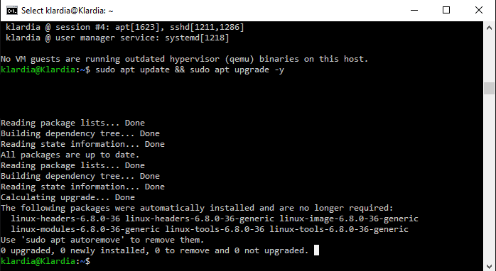
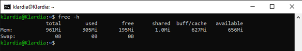
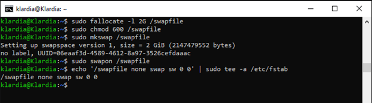
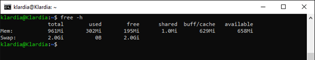

## TUGAS 6

**# Lakukan Update & Upgrade di VPS Ubuntu** 

Melakukan pembaruan dan upgrade pada server adalah langkah pertama yang wajib dilakukan agar sistem aman dan paket aplikasi terbaru.  
   
Untuk melakukan pembaharuan, gunakan perintah berikut:

```bash
sudo apt update && sudo apt upgrade -y
```

<div style="text-align: center;">
  
</div>

Dikarenakan saya sudah uptodate maka akan muncul 0 upgraded, 0 newly installed, 0 to remove and 0 not upgraded.

**# Setup Swap Memory sebesar 2GB**

Melakukan Swap memory yang mana untuk penyelamatan saat Ram fisik penuh ketika spesifikasi server hanya mempunyai RAM kecil, sehingga Swap ini bertindak yang disimpan di ssd.

<div style="text-align: center;">
  
</div>

Ini adalah memory yang saya punya saat ini. Langkah untuk melakukan Swap berikut ini:

```bash
sudo fallocate -l 2G /swapfile
```
***“fungsi dari bash tersebut adalah untuk membuat file kosong sebesar 2GB”***

```bash
sudo chmod 600 /swapfile
```
***“fungsi dari bash ini adalah untuk membuat file swap tidak boleh bisa dibaca oleh user lain selain root”***

```bash
sudo mkswap /swapfile
```
***“untuk memberi tahu sistem bahwa file tersebut berfungsi sebagai ruang swap”***

```bash
sudo swapon /swapfile
```
***“menyalakan swap agar sistem mulai menggunakannya”***

```bash
echo '/swapfile none swap sw 0 0' | sudo tee -a /etc/fstab
```
***“perintah diatas untuk membuat sap tidak hilang saat server di reboot”***

<div style="text-align: center;">
  
</div>


**# Verifikasi menggunakan command: free -h**

Untuk memastikan swap yang dibuat 2GB sudah aktif dengan menjalankan perintah dibawah ini
Bash:

```bash
Free -h
```

<div style="text-align: center;">
  
</div>